# 📖 Eternal Grimoire

> **A streaming database backup, compression, and recovery tool written in Go.**

**Eternal Grimoire** is a modular database backup utility designed to stream database dumps directly through compression layers into storage destinations (local filesystem, cloud storage) without requiring intermediate disk writes.

---

## 🚀 Features

- 🐘 **PostgreSQL Support**: Integrated streaming backups and restores using PostgreSQL native utilities (`pg_dump` and `pg_restore`) with custom archive format (`-F c`).
- 🗜️ **Streamed Compression**: In-memory streaming compression and decompression using Gzip (`compress/gzip`) to minimize memory footprint and disk I/O.
- 💾 **Pluggable Storage Providers**:
  - **Local Filesystem**: Store and retrieve backup archives in configured local directories with path sanitization.
  - **Extensible Interface**: Ready for object storage targets (AWS S3, MinIO, Google Cloud Storage).
- ⚙️ **Declarative Configuration**: Centralized YAML-based configuration for database credentials and storage endpoints.
- 🧩 **Modular Architecture**: Clean separation of concerns with Go interfaces for backup engines, compressors, and storage providers.

---

## 🏗️ Architecture & Data Flow

Eternal Grimoire connects components using Go `io.Pipe` and `io.Reader`/`io.Writer` streaming pipelines.

```mermaid
flowchart TD
    subgraph BackupPipeline ["Backup Flow (Streaming)"]
        direction LR
        DB[(PostgreSQL)] -->|"pg_dump (stdout)"| EngineB["backup.Engine"]
        EngineB -->|"io.Pipe"| GzipB["compression.Compress"]
        GzipB -->|"Compressed Stream"| StoreB["storage.StorageProvider"]
        StoreB --> DestB[("Storage Destination")]
    end

    subgraph RestorePipeline ["Restore Flow (Streaming)"]
        direction LR
        SrcR[("Storage Destination")] -->|"Retrieve()"| StoreR["io.ReadCloser"]
        StoreR -->|"io.Pipe"| GzipR["compression.Decompress"]
        GzipR -->|"Raw Dump Stream (stdin)"| EngineR["backup.Engine"]
        EngineR -->|"pg_restore"| TargetDB[(PostgreSQL)]
    end
```



---

## 📁 Repository Structure

```
.
├── config.yml              # Database & storage configuration
├── go.mod                  # Go module definition (Go 1.26+)
├── go.sum                  # Dependency checksums
├── main.go                 # Application entrypoint & CLI commands
├── backups/                # Default directory for local backup artifacts
└── internal/
    ├── backup/             # Database backup engines
    │   ├── backup.go       # Engine interface definition
    │   └── postgres.go     # PostgreSQL engine implementation
    ├── compression/        # Compression & decompression algorithms
    │   ├── compression.go  # Compress interface definition
    │   └── gzip.go         # Gzip compression implementation
    ├── config/             # Configuration parsing & data structures
    │   └── config.go       # YAML config loader
    └── storage/            # Storage backends
        ├── storage.go      # StorageProvider interface definition
        └── local.go        # Local filesystem storage implementation
```

---

## 🔧 Core Interfaces

Eternal Grimoire is built around three core interfaces to make extending functionality straightforward:

### 1. Backup Engine (`internal/backup/backup.go`)
```go
type Engine interface {
    Backup(ctx context.Context, dst io.Writer) error
    Restore(ctx context.Context, src io.Reader) error
}
```

### 2. Compression (`internal/compression/compression.go`)
```go
type Compress interface {
    Compress(src io.Reader, dst io.Writer) error
    Decompress(src io.Reader, dst io.Writer) error
}
```

### 3. Storage Provider (`internal/storage/storage.go`)
```go
type StorageProvider interface {
    Store(ctx context.Context, name string, data io.Reader) error
    Retrieve(ctx context.Context, name string) (io.ReadCloser, error)
    List(ctx context.Context) ([]string, error)
}
```

---

## ⚙️ Configuration

Configuration is managed via `config.yml`. Example:

```yaml
database:
  type: postgres
  host: localhost
  port: 5432
  username: postgres
  password: "your_password"
  database: auth-db

storage:
  enabled: false
  type: s3
  bucket: my-backup
  region: us-west-2
```

### Configuration Parameters

| Section | Key | Type | Description |
| :--- | :--- | :--- | :--- |
| `database` | `type` | string | Database engine type (e.g., `postgres`) |
| `database` | `host` | string | Database host address |
| `database` | `port` | int | Database port number (default: `5432`) |
| `database` | `username` | string | Database user with dump/restore permissions |
| `database` | `password` | string | Password for authentication |
| `database` | `database` | string | Target database name |
| `storage` | `enabled` | bool | Enable remote storage provider |
| `storage` | `type` | string | Storage backend type (`local`, `s3`) |
| `storage` | `bucket` | string | Cloud storage bucket name |
| `storage` | `region` | string | Cloud storage region |
| `storage` | `access_key` | string | Cloud storage access key credential |
| `storage` | `secret_key` | string | Cloud storage secret key credential |

---

## 📦 Prerequisites & Installation

### Prerequisites
- **Go**: Version `1.22+` (or `1.26+`)
- **PostgreSQL Client Tools**: `pg_dump` and `pg_restore` installed and accessible in your system `$PATH`.

### Build

```bash
# Clone the repository
git clone https://github.com/abhijit1859/eternal_grimoire.git
cd eternal_grimoire

# Download dependencies
go mod download

# Build binary
go build -o grimoire main.go
```

---

## 🗺️ Roadmap

- [ ] **CLI Subcommands**: Full CLI execution for `backup`, `restore`, and `list` commands.
- [ ] **AWS S3 / MinIO Provider**: Stream backups directly to S3-compatible object storage.
- [ ] **Retention Policies**: Automatic pruning of old backups based on count or age.
- [ ] **Additional Engines**: Support for MySQL/MariaDB, MongoDB, and SQLite.
- [ ] **Encryption**: Optional at-rest AES-GCM streaming encryption.
- [ ] **Cron / Daemon Mode**: Automated recurring backups with metric reporting.

---

## 📄 License

This project is licensed under the MIT License.
